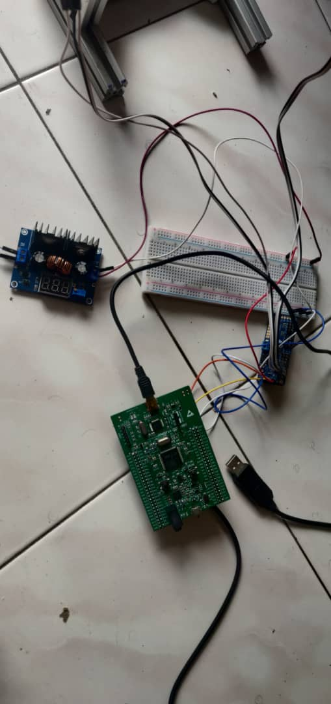

# stm32-voice-controlled-robot
##  SEEL 5123 (Advanced Microprocessor) Project Demo
### Group members: 
1. Mohamed Afifi Ahmed Mahmoud Khalil  
2. Mahmoud Abdelwase Mahmoud  
3. Omar Amgad elsayed abdelmonem 
## Project Overview
This project is a baremetal STM32F4 implementation for controlling a robotic leg prototype of a full robot dog using on-board microphone and audio recognition. The main goal is to allow users to issue simple single-word commands to the robot dog, similar to how one would command a real dog. The commands implemented in this project are "go", "up", and "down".

The on-board microphone is connected to the STM32F4 microcontroller using I2S and DMA is used to transfer audio samples from the I2S peripheral to memory for further processing. The leg is equipped with two servos controlled by a servo driver, which is in turn controlled by the STM32F4 microcontroller via I2C.

The robot dog leg only listens to commands after a UART message is received, which can be wired directly with a laptop to send the commands. The audio is recorded using the on-board microphone and processed using CMSIS-DSP and PDMTOPCM libraries. The actual audio recognition is performed by a Tensorflow Lite model using the STM32_AI_AudioProcessing library and X-CUBE AI.

A video demonstration of the project's functionality is included to showcase how the robot dog leg responds to the different commands.
[Project Demo Video](https://drive.google.com/file/d/17mQbjMNJD_8ZyQnKu04J_priBaOl0OJT/view?usp=sharing)
## Hardware Requirements
* STM32F407G-DISC1 Discovery board
* USB-to-UART cable
* I2C servo driver
* Buck convertor to power the servos
* A servo-controlled robotic dog leg
* Laptop or desktop computer with a terminal emulator installed

 

## Limitations
During the development of this project, we attempted to use FreeRTOS to allow the robot leg to perform multiple tasks concurrently. However, due to the limited amount of available RAM on the STM32F4 Discovery board, we were unable to allocate sufficient memory to the FreeRTOS kernel. As a result, the robot is not able to execute tasks concurrently and will stop whatever it is doing while it is recording and processing the audio for command recognition. While this limitation restricts the robot's functionality, it provides a valuable lesson in working with limited hardware resources and optimizing system design.

## Future Improvements 
Some future improvements that could be made to this project include:
* Implementation of a Bluetooth or WiFi module to allow for wireless command sending.
* Further optimization of the audio recognition system, such as improving the accuracy and reducing response time.
* Improving the robot leg's ability to execute tasks concurrently, such as by exploring more lightweight task scheduling libraries or offloading some tasks to external hardware. This would allow the robot to continue functioning while recording and processing audio for command recognition.
* Development of a complete robot dog using multiple legs and more advanced functionality.

## Main Reference
https://github.com/FedericaPaoli1/stm32-speech-recognition-and-traduction
